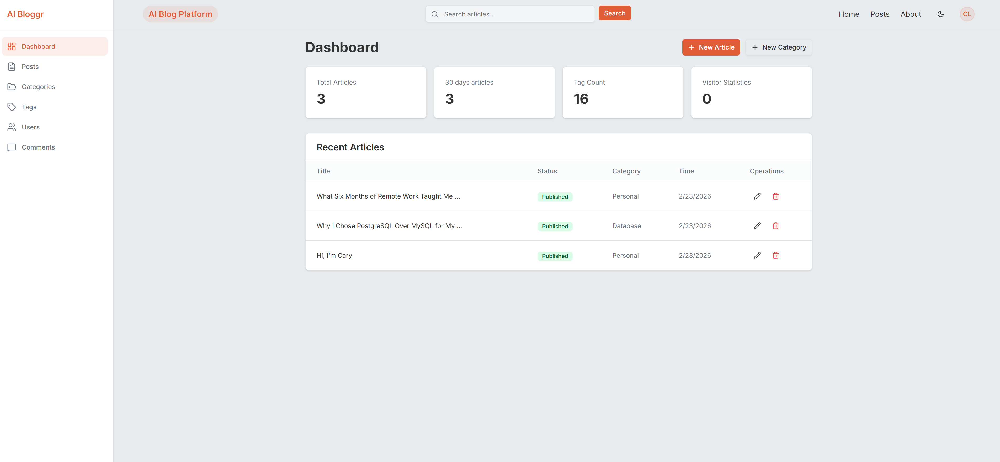
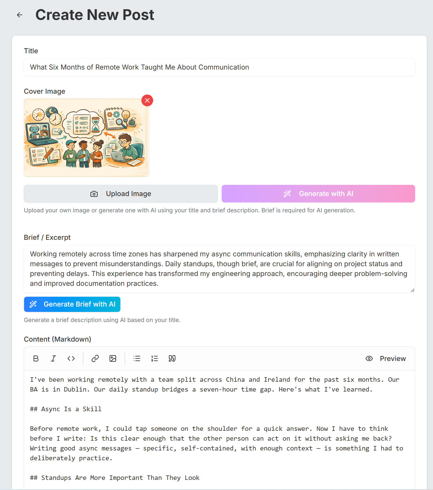

# AI Blog


> A full-stack blog platform where publishing an article triggers a 3-stage AI pipeline to auto-generate a cover image, and search works by semantic similarity — not keywords.

**[🔗 Live Demo](https://blog.kaili.dev)** · **[中文文档](./README_CN.md)**

---

<p align="center">
  
</p>

<p align="center">
  
</p>

<p align="center">
  
  
</p>

---

## ✨ Highlights

### 3-Stage AI Cover Generation Pipeline
Publishing an article fires an async pipeline via Next.js `after()` that runs three sequential steps: GPT-4o-mini summarizes the article (with automatic language detection for Chinese and English), GPT-4o translates the summary into an optimized image generation prompt, then `gpt-4o-image` generates the cover and uploads it to Cloudinary in WebP format. The pipeline runs after the response is returned to the client — the publish action completes immediately.

### Semantic Search via pgvector
Articles are chunked by paragraph boundaries before indexing — 8,191-token limit per chunk with a 50-token overlap to preserve context. Each chunk is embedded using OpenAI's `text-embedding-3-small` into a 1536-dimensional vector stored in PostgreSQL via `pgvector`. Search queries are embedded at runtime and matched by cosine similarity, returning conceptually relevant results rather than keyword matches.

### Two-Layer Rate Limiting with Automatic Fallback
Rate limits for comments and password resets are enforced through two layers: Vercel KV (Redis) for fast in-memory checks as the primary, and PostgreSQL as an automatic fallback when KV is unavailable. Limits are configurable per action type (`comment`: 2 per 60s, `password_reset`: 1 per 15min).

---

## Tech Stack

| Layer | Technology |
|---|---|
| Framework | Next.js 16 (App Router, Turbopack) |
| UI | React 19, Tailwind CSS v4, Radix UI, shadcn/ui |
| Language | TypeScript 5 |
| Database | PostgreSQL (Neon Serverless) + pgvector |
| ORM | Prisma 6 |
| Auth | NextAuth v5 beta (JWT strategy) |
| AI | OpenAI API (GPT-4o, GPT-4o-mini, text-embedding-3-small) |
| Async Tasks | Next.js `after()` API |
| Image Storage | Cloudinary |
| Cache / Rate Limit | Vercel KV (Redis) |
| Email | Resend |
| Validation | Zod + react-hook-form |
| Testing | Vitest |
| Deployment | Vercel |

---

## Features

### Authentication
Multi-provider auth built with NextAuth v5 beta:
- **OAuth**: GitHub and Google, with automatic account linking when the same email is detected across providers
- **Credentials**: Email + password with bcryptjs hashing
- **JWT strategy**: Stateless sessions with role (`user` / `admin`) encoded in the token

### Role-Based Access Control
Admin-only routes cover article creation, editing, deletion, and user management. Public routes are explicitly whitelisted; all others require authentication.

### Nested Comments
Comments support arbitrary nesting via a self-referencing `parentId` foreign key.

### Markdown Editor & Renderer
Custom renderer built on `marked` + `Prism.js`:
- Syntax highlighting for TypeScript, JavaScript, JSX/TSX, Python, CSS, JSON, Bash
- One-click copy button on code blocks
- Responsive tables, styled blockquotes, external links open in new tab
- Real-time word count and line statistics

---

## Architecture

**Server Actions as the API layer** — All mutations go through Next.js Server Actions with Zod validation, keeping full type safety from client form to database without a separate REST API.

**Neon Serverless adapter** — Prisma is configured with `@prisma/adapter-neon` for connection pooling that works correctly in Vercel's serverless environment.

**Next.js `after()` for async tasks** — The cover generation pipeline and embedding indexing run after the response is sent to the client, keeping publish actions fast without blocking the user.

**Security headers** — `X-Frame-Options: DENY` and `X-Content-Type-Options: nosniff` are set globally in `next.config.ts`. Console logs are stripped from production builds.

### Database Schema (simplified)

```
User ──< Account (OAuth providers)
User ──< Post ──< Comment (self-referencing for nesting)
                ──< PostEmbedding (vector: 1536 dims)
Post >── Category
Post >──< Tag (many-to-many)
User ──< PasswordResetToken
RateLimit (by userId + action type)
```

---

## Getting Started

### Prerequisites

- Node.js 20+
- PostgreSQL database with `pgvector` extension enabled (e.g. [Neon](https://neon.tech))
- OpenAI API key
- Cloudinary account
- GitHub and/or Google OAuth app credentials

### Installation

```bash
git clone https://github.com/kaili-lab/blog-v1.git
cd blog-v1
npm install
```

### Environment Variables

Copy `.env.example` to `.env.local` and fill in the values:

```env
# Auth
AUTH_SECRET=

# Database
DATABASE_URL=

# OAuth
GITHUB_CLIENT_ID=
GITHUB_CLIENT_SECRET=
GOOGLE_CLIENT_ID=
GOOGLE_CLIENT_SECRET=

# AI
OPENAI_API_KEY=

# Image storage
NEXT_PUBLIC_CLOUDINARY_CLOUD_NAME=
CLOUDINARY_API_KEY=
CLOUDINARY_API_SECRET=

# Vercel Cron Job auth
CRON_SECRET=

# Cache & rate limiting
KV_URL=
KV_REST_API_URL=
KV_REST_API_TOKEN=

# Email
RESEND_API_KEY=
```

### Run Locally

```bash
# Apply database migrations
npx prisma migrate deploy

# Start dev server
npm run dev
```

### Vercel Cron Job Setup

A weekly cron job (`/api/cron/cleanup-rate-limits`) deletes expired rate-limit records. It is secured with a `CRON_SECRET` header verified by the route handler.

Add `CRON_SECRET` to your Vercel environment variables (any random string). The schedule is defined in `vercel.json` and runs every Monday at midnight UTC.

### Run Tests

```bash
npm test
```

---

## License

MIT

---

